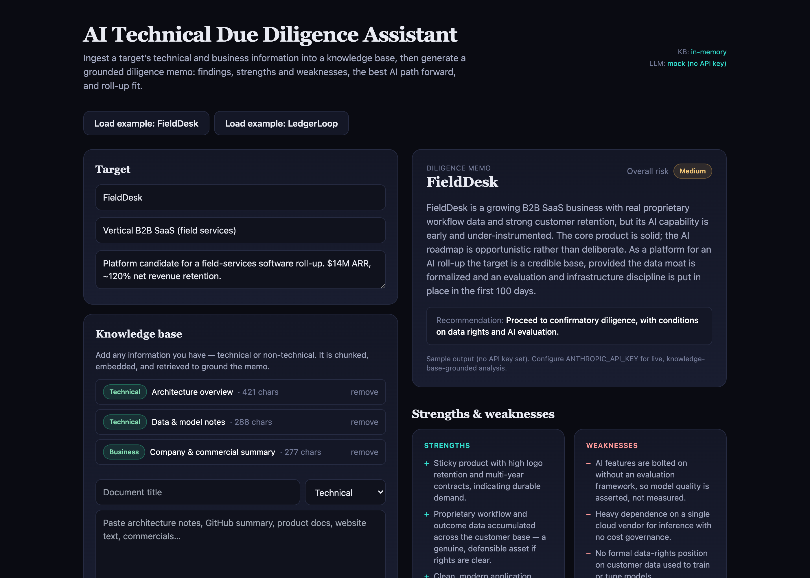
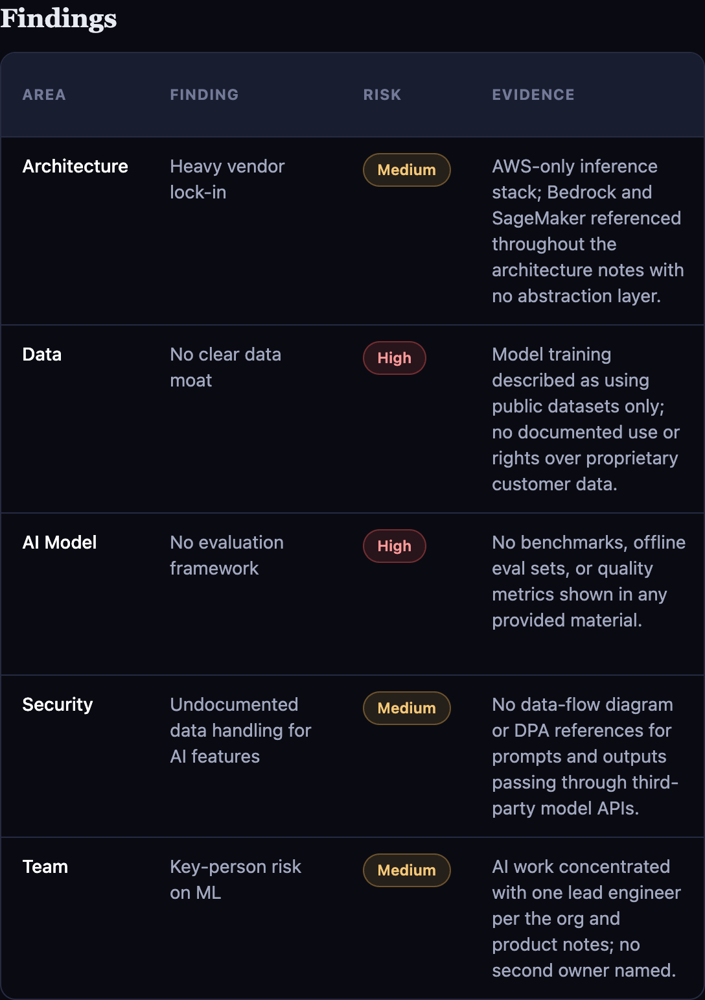

# AI Technical Due Diligence Assistant

An AI diligence tool for investors pursuing an **AI roll-up / buy-and-build** strategy. Point it at a target company's information — technical *and* non-technical — and it produces a grounded, structured **diligence memo**: findings with evidence, the business's strengths and weaknesses, the best AI path forward, and roll-up fit.

Built for the reality that a target often **doesn't know what it doesn't know** about AI. The tool assesses what's there, flags the gaps as follow-up questions for confirmatory diligence, and recommends where AI would actually create value.

> This is an early-stage screen to focus confirmatory diligence and value-creation planning. It is **not** a substitute for confirmatory technical, legal, or financial diligence.

## Screenshots

Ingest a target's documents, then generate the memo. Shown in **demo mode** (no API key → in-memory knowledge base + a sample memo):



The structured findings table — each finding grounded in the retrieved evidence, with a triage risk level:



## What it produces

A structured memo with:

- **Executive summary + overall risk + recommendation** (Proceed / Proceed with conditions / Pass)
- **Findings table** — `Area · Finding · Risk · Evidence · Follow-up Question`, grounded in the knowledge base
- **Strengths & weaknesses** of the business
- **Best AI path forward** — prioritized AI opportunities, each tied to a value lever
- **Roll-up fit** — platform vs bolt-on, integration risk, tech-stack consolidation
- **Key risks**

## How it works

```
Documents (technical + non-technical)
        │  chunk + embed
        ▼
   Knowledge base  ──(retrieve top-k)──►  Claude  ──►  structured memo
 (Postgres+pgvector                     (strict tool-use,
   or in-memory)                         schema-validated)
```

1. **Ingest** any information into a per-company knowledge base — it's chunked and embedded.
2. **Retrieve** the most relevant passages per diligence dimension (architecture, data, model, security, team, commercials).
3. **Generate** a memo with Claude, grounded in the retrieved context and returned as validated structured output.

## Tech stack

- **Next.js 14** (App Router) + **TypeScript** + **Tailwind**
- **Anthropic Claude** (`claude-opus-4-8`) via the official SDK, using strict tool-use for schema-valid structured output
- **RAG knowledge base**: **Postgres + pgvector** via **Prisma** (production), or a zero-infra **in-memory** backend (demo)
- **Voyage AI** embeddings (optional), with a dependency-free local embedding fallback

## Runs out of the box

Everything is optional — the app degrades gracefully so a demo never breaks:

| Env var | Set | Unset (fallback) |
|---|---|---|
| `ANTHROPIC_API_KEY` | live Claude analysis | high-quality **mock** memo |
| `DATABASE_URL` | Postgres + pgvector | **in-memory** knowledge base |
| `VOYAGE_API_KEY` | Voyage embeddings | local deterministic embedding |

### Quick start (demo mode — no keys, no database)

```bash
npm install
npm run dev
# open http://localhost:3000, click "Load example", then "Generate diligence memo"
```

### Full setup (live Claude + Postgres knowledge base)

```bash
cp .env.example .env         # add ANTHROPIC_API_KEY; keep DATABASE_URL
docker compose up -d         # Postgres 16 + pgvector
npm install
npm run prisma:migrate       # create tables
npm run seed                 # load sample companies into the KB
npm run dev
```

## Project layout

```
app/
  api/ingest/route.ts    # add documents to the knowledge base
  api/analyze/route.ts   # retrieve context → Claude (or mock) → memo
  page.tsx               # intake + knowledge base + memo UI
lib/
  schema.ts              # zod schema for the memo
  prompt.ts              # diligence system prompt
  anthropic.ts           # Claude call (strict tool-use structured output)
  mock.ts                # sample memo when no API key
  embeddings.ts          # Voyage or local embedding + cosine + chunking
  kb/                    # KnowledgeBase interface + Postgres and in-memory backends
components/              # memo, findings table, SWOT, opportunities, roll-up fit
prisma/                  # schema + seed
```

## Limitations

This is a diligence **screen**, not a substitute for confirmatory diligence — and the prototype has clear edges:

- **Mock mode is illustrative.** Without `ANTHROPIC_API_KEY`, the memo is a fixed sample so the demo always runs; it is not analysis of your input.
- **The local embedding is demo-grade** (lexical, not semantic). Production-quality retrieval needs `VOYAGE_API_KEY` and the Postgres + pgvector backend.
- **Single-pass retrieval.** Top-k per dimension with no re-ranking, query expansion, or citation back to the exact source span yet.
- **No auth / multi-tenancy / persistence guarantees** on the in-memory backend (process-local, ephemeral).
- **Input is trusted text.** No document parsing (PDF/DOCX), OCR, or ingestion of live repos/data rooms yet.
- **The model can be wrong.** Findings are prompts for human review, not determinations; always verify against the source.

## Roadmap

- Wire the production path end to end (Voyage embeddings + Postgres/pgvector) with a seeded demo dataset.
- Add an **evaluation harness** for memo quality (rubric-graded, so output is measured, not asserted).
- **Source citations** that link each finding back to the exact ingested passage.
- **Connectors**: ingest a GitHub repo, a website, or a data-room export directly.
- **Export**: one-click memo to PDF / IC-ready slide.
- Multi-target **portfolio view** to compare diligence across a pipeline.

## License

MIT
